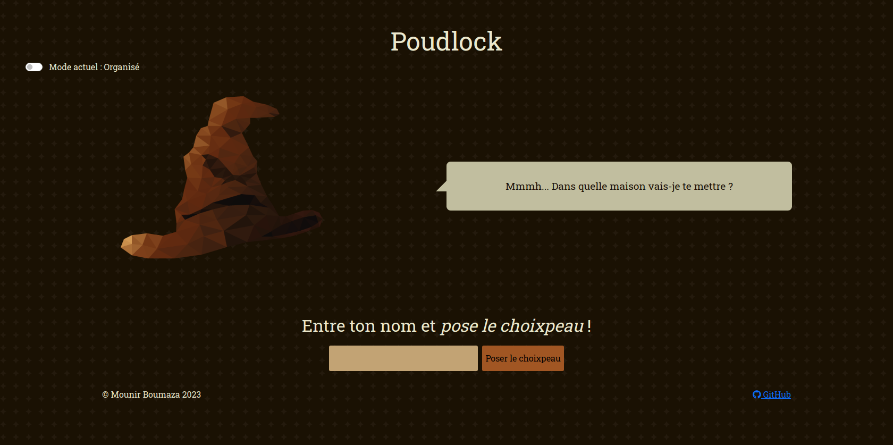

# Poudlock

Il était une fois, une école d'apprentis magidevs du nom de Poudlock. Cette école a été fondée par 4 personnes aux talents divers et complémentaires : **Anthony**, **Dario**, **Lucie** et **Maxime**.

Ces derniers décidèrent de diviser l'école en 4 maisons distinctes basées sur leurs noms. Pour ce faire, nos magidevs conçurent un habile système de sélection bâptisé le **choixpeau** ! *Toute ressemblance avec une oeuvre de fiction serait purement fortuite.*

- <a href="https://poudlock.vercel.app/" target="_blank">Faites le test !</a>
<!-- - [Faites le test !](https://stellar-views.vercel.app/) -->

## Fonctionnalités

Quand on entre un nom dans le champ du formulaire et qu'on valide, le choixpeau affiche le blason d'une des maisons de Poudlock dans sa bulle de dialogue. Si on valide le formulaire vide, il donne un message d'erreur.

### Captures d'écran

### Mode chaotique

Quand on tape le nom d'un apprenti magidev, on affiche un blason de manière aléatoire.

### Mode organisé

Quand on tape le nom d'un apprenti magidev, on affiche un blason selon des règles prédéfinies :

- Si le nom contient exactement **8 caractères**, on affiche le blason de la maison **Maxopus**.
- Sinon, si la **première** lettre du nom est un **L** ou la **dernière** un **X**, on affiche le blason de la maison **Lustrix**.
- Sinon, si le nombre de lettres du nom est un **multiple de 5** ou un **multiple de 3**, on affiche le blason de la maison **Anthorvus**.
- Sinon, on affiche le blason de la maison **Darioptera**.

## Remarques

Ce projet a été réalisé dans le cadre d'un exercice pour pratiquer Javascript (vanilla).
